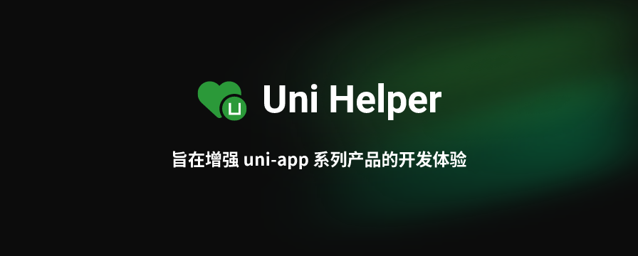

  

  
  
  
  
  

# 👋 欢迎来到 Uni Helper

Uni Helper 的目标是让 uni-app 开发过程更直观、高效，开发体验更出色！

## 🪄 官网

看看我们的官网 [uni-helper.js.org](https://uni-helper.js.org/)，探索 uni-helper 的所有项目。

## 💬 社区

uni-helper 欢迎有意愿增强 uni-app 系列产品的开发体验的朋友加入, 让我们一起把 uni-app 系列产品变得更好。❤

- [QQ 交流群1](https://qm.qq.com/q/FltLyK6640)
- [QQ 交流群2](https://qm.qq.com/q/5nPFSqa8Eg)
- [微信交流群](https://wx.hlcode.cn/?id=NE0myp6)
- [Discussions](https://github.com/orgs/uni-helper/discussions)
